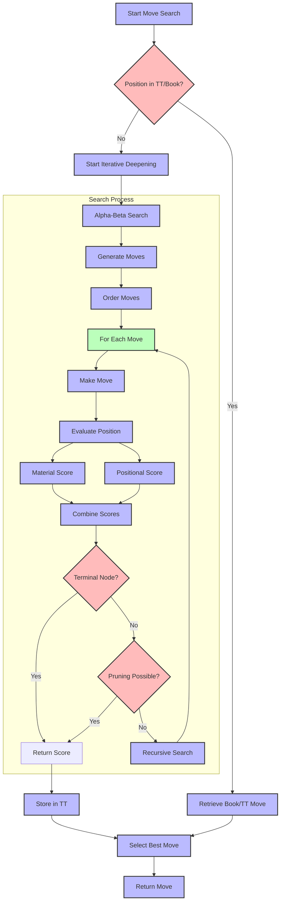

```mermaid
flowchart TD
    Start[Start Move Search] --> Check{Position in TT/Book?}
    
    Check -->|Yes| Book[Retrieve Book/TT Move]
    Check -->|No| ID[Start Iterative Deepening]
    
    ID --> AB[Alpha-Beta Search]
    
    subgraph "Search Process"
        AB --> MG[Generate Moves]
        MG --> Order[Order Moves]
        Order --> Loop[For Each Move]
        
        Loop --> Make[Make Move]
        Make --> Eval[Evaluate Position]
        
        Eval --> Material[Material Score]
        Eval --> Position[Positional Score]
        
        Material --> Score[Combine Scores]
        Position --> Score
        
        Score --> Terminal{Terminal Node?}
        Terminal -->|Yes| Return[Return Score]
        Terminal -->|No| Pruning{Pruning Possible?}
        
        Pruning -->|Yes| Return
        Pruning -->|No| Recurse[Recursive Search]
        Recurse --> Loop
    end
    
    Return --> Store[Store in TT]
    Store --> Best[Select Best Move]
    
    Book --> Best
    Best --> End[Return Move]
    
    classDef process fill:#bbf,stroke:#333,stroke-width:2px
    classDef decision fill:#fbb,stroke:#333,stroke-width:2px
    classDef data fill:#bfb,stroke:#333,stroke-width:2px
    
    class Start,Book,ID,AB,MG,Order,Make,Eval,Material,Position,Score,Recurse,Store,Best,End process
    class Check,Terminal,Pruning decision
    class Loop data
```