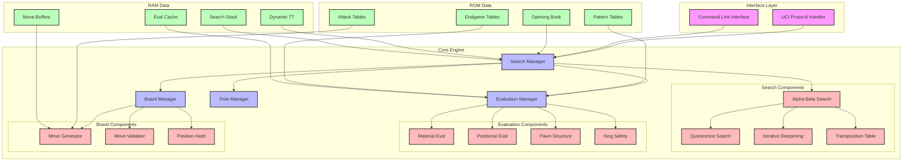

```mermaid
graph TB
    subgraph Interface Layer
        UCI[UCI Protocol Handler]
        CLI[Command Line Interface]
    end

    subgraph Core Engine
        direction TB
        Search[Search Manager]
        Eval[Evaluation Manager]
        Board[Board Manager]
        Time[Time Manager]
        
        subgraph Search Components
            AB[Alpha-Beta Search]
            QS[Quiescence Search]
            ID[Iterative Deepening]
            TT[Transposition Table]
        end
        
        subgraph Evaluation Components
            Mat[Material Eval]
            Pos[Positional Eval]
            PS[Pawn Structure]
            KS[King Safety]
        end
        
        subgraph Board Components
            MG[Move Generator]
            Val[Move Validator]
            Hash[Position Hash]
        end
    end

    subgraph ROM Data
        OB[Opening Book]
        PT[Pattern Tables]
        ET[Endgame Tables]
        AT[Attack Tables]
    end

    subgraph RAM Data
        DT[Dynamic TT]
        EC[Eval Cache]
        SS[Search Stack]
        MB[Move Buffers]
    end

    %% Interface connections
    UCI --> Search
    CLI --> Search
    
    %% Core component connections
    Search --> Board
    Search --> Eval
    Search --> Time
    
    %% Search component connections
    Search --> AB
    AB --> QS
    AB --> ID
    AB --> TT
    
    %% Evaluation component connections
    Eval --> Mat
    Eval --> Pos
    Eval --> PS
    Eval --> KS
    
    %% Board component connections
    Board --> MG
    Board --> Val
    Board --> Hash
    
    %% ROM data connections
    OB --> Search
    PT --> Eval
    ET --> Eval
    AT --> MG
    
    %% RAM data connections
    DT --> Search
    EC --> Eval
    SS --> Search
    MB --> MG

    classDef interface fill:#f9f,stroke:#333,stroke-width:2px
    classDef core fill:#bbf,stroke:#333,stroke-width:2px
    classDef memory fill:#bfb,stroke:#333,stroke-width:2px
    classDef component fill:#fbb,stroke:#333,stroke-width:2px
    
    class UCI,CLI interface
    class Search,Eval,Board,Time core
    class OB,PT,ET,AT,DT,EC,SS,MB memory
    class AB,QS,ID,TT,Mat,Pos,PS,KS,MG,Val,Hash component
```