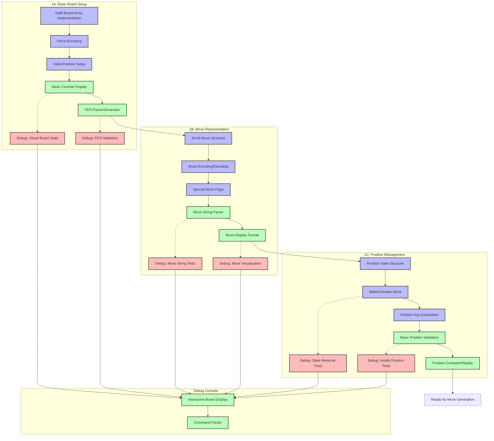

```mermaid
flowchart TD
    subgraph "1A: Basic Board Setup"
        A1[0x88 Board Array Implementation] --> A2[Piece Encoding]
        A2 --> A3[Initial Position Setup]
        A3 --> A4[Basic Console Display]
        A4 --> A5[FEN Parser/Generator]
        
        A4 -.-> D1[Debug: Visual Board State]
        A5 -.-> D2[Debug: FEN Validation]
    end

    subgraph "1B: Move Representation"
        B1[24-bit Move Structure] --> B2[Move Encoding/Decoding]
        B2 --> B3[Special Move Flags]
        B3 --> B4[Move String Parser]
        B4 --> B5[Move Display Format]
        
        B4 -.-> D3[Debug: Move String Tests]
        B5 -.-> D4[Debug: Move Visualization]
    end

    subgraph "1C: Position Management"
        C1[Position State Structure] --> C2[Make/Unmake Move]
        C2 --> C3[Position Key Generation]
        C3 --> C4[Basic Position Validation]
        C4 --> C5[Position Compare/Display]
        
        C2 -.-> D5[Debug: State Reversal Tests]
        C4 -.-> D6[Debug: Invalid Position Tests]
    end

    subgraph "Debug Console"
        D1 --> D7[Interactive Board Display]
        D2 --> D7
        D3 --> D7
        D4 --> D7
        D5 --> D7
        D6 --> D7
        D7 --> D8[Command Parser]
    end

    A5 --> B1
    B5 --> C1
    C5 --> Next[Ready for Move Generation]

    classDef implementation fill:#bbf,stroke:#333,stroke-width:2px
    classDef debug fill:#fbb,stroke:#333,stroke-width:2px
    classDef console fill:#bfb,stroke:#333,stroke-width:2px
    
    class A1,A2,A3,B1,B2,B3,C1,C2,C3 implementation
    class D1,D2,D3,D4,D5,D6 debug
    class A4,A5,B4,B5,C4,C5,D7,D8 console
```